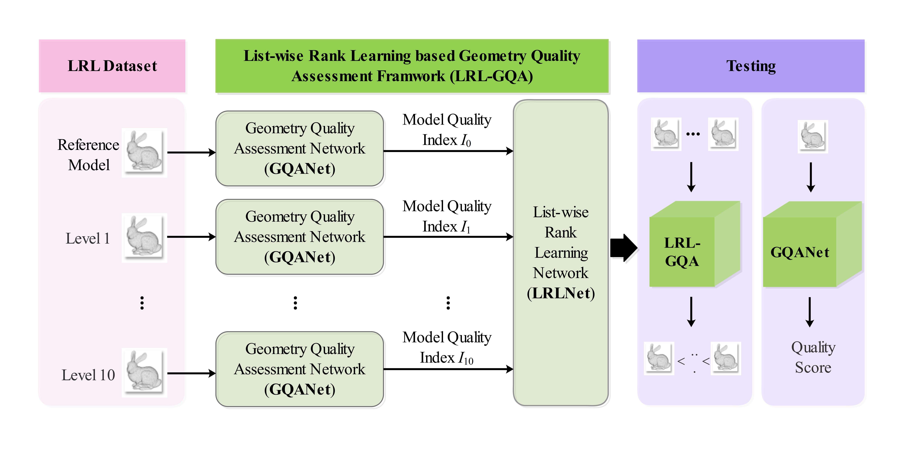
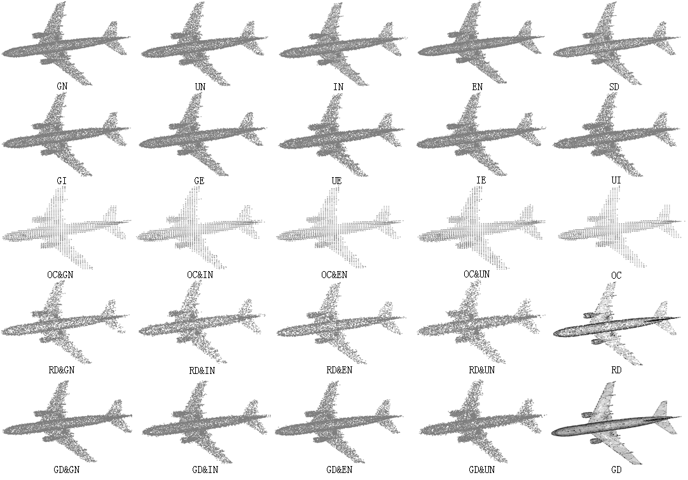

# LRL-GQA

No-reference Geometry Quality Assessment for Point Clouds Via List-wise Rank Learning  based on deep list-wise rank learning, named `LRL-GQA`, and a new large-scale pairwise ranking learning dataset called `LRL_datasets`.

# Overview

A no-reference geometry quality assessment for point clouds via list-wise rank learning (`LRL-GQA`) is proposed, in which the geometric feature extraction, weighted quality index calculation, and pairwise rank learning are jointly optimized in an end-to-end manner.




A new list rank dataset named `LRL_datasets` is constructed, which includes 200 reference point clouds and 4400 lists of distorted samples.



Our `LRL_datasets` dataset is released in four parts, namely [part_1](https://drive.google.com/file/d/18X0c3ROGvLFXRjS3FiJXeigZfZFF6Brw/view?usp=share_link), [part_2](https://drive.google.com/file/d/16uoicJeXmGPGqB-ION27_wInKF2YBN6u/view?usp=share_link), part_3, and part_4.


# Run Program

Please copy the `LRL_datasets` dataset in the program same root directory

Run preprocessing:

```shell
python generate_level_txt.py
python list_dataloader_fixed_patch.py

```

Train feature network:

```she	
python train_graph_feature.py
python generation_feature_and_label.py
python listnet_rank_model.py
```

